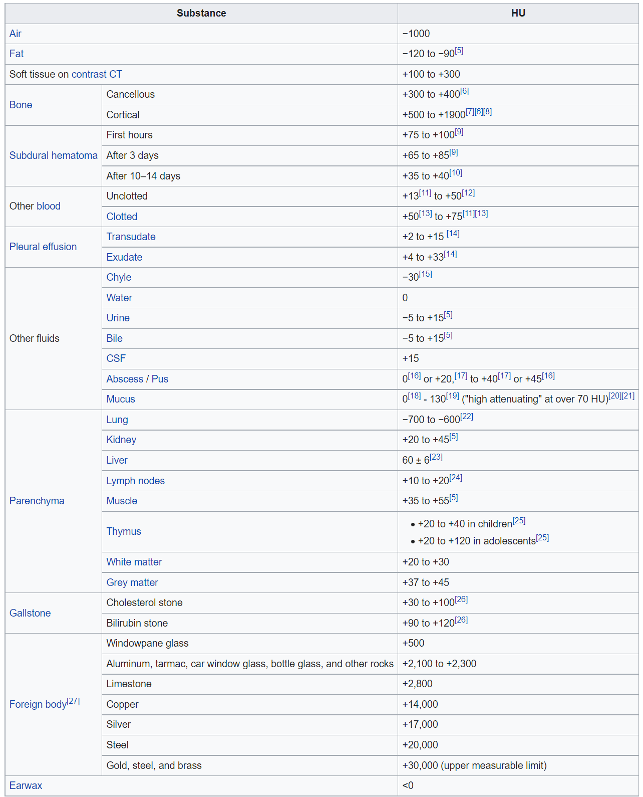

# CT_lung_detection

# Akciğer BT Görüntüleri ile Segmentasyon Yapımı 
Bu projenin amacı BT görüntülerinden akciğeri segmente ederek direkt olarak ilgi alnı haline getirerek yapay zeka nın odak alanın akciğerler olmasını sağlayarak modelin daha iyi eğitilmesini kolaylaştırır.

Bu projede her bir hastanın akciğer görüntüleri ile Segmentesyon yaparak 3D görüntüler elde edilmesi amaçlanmaktadır. Öncelikle DICOM formatındaki datanın nasıl ele alınacağını sonrasında Akciğer BT görüntülerine bu öğrenilen yöntemlerle segemnetasyonu gözlemlenecektir. Bu projenin devamında da 3 boyutlu dataları derin ağ mimarileri yardımıyla eğitilerek kanser teşhisinde yardımcı destek mekanizması oluşturulması planlanmaktadır.

### DICOM

DICOM, tıbbi görüntüleme sistemlerinin ekmek kapısıdır. Biyomedikal Mühendisi, sağlık hizmetleri alanında BT Uzmanı veya Sağlık Hizmetleri Veri Bilimcisi/Analistiyseniz, tıbbi görüntüleme sistemleriyle ilgili her yerde olduğu için muhtemelen DICOM'u kullanmış veya en azından duymuşsunuzdur.

DICOM, Tıpta Dijital Görüntüleme ve İletişim, örneğin; BT, MRI, Ultrason vb. birden fazla üretici arasında, böylece DICOM uyumlu olan tüm tıbbi makineler bir ağ üzerinden bilgi gönderirken aynı dili konuşabilir.

DICOM dosyaları genellikle yalnızca piksel verilerinden başka bilgilere sahiptir. DICOM Standartları, DICOM dosyalarında depolanan verileri standart hale getirmek için bir dizi öznitelik sağlar. Her öznitelik, sabit bir değer temsiliyle belirli bir veri türüne (ör. dize, tamsayı, kayan nokta vb.) sahiptir. Bu niteliklere meta veri denir. DICOM meta verisi örnekleri:

* Hastayla ilgili özellikler: isim, yaş, cinsiyet, vb.
* Modalite ile ilgili özellikler: modalite (CT, MRI, Ultrason, vb.), üretici, satın alma tarihi vb.
* Görüntüyle ilgili nitelikler: şekil, örnekleme, en boy oranı, piksel verileri vb.

> Not:  Bahsettiğimiz görüntüyle ilgili özniteliklerin, tıbbi görüntüler üzerinde gerçek dünya hesaplamalarını uygulamak için yararlı olduklarından anlaşılması çok önemlidir. Fakat bahsedeceğimiz büyük ölçüde güveneceğiz.

DICOM dosyalarını karakterize edebilecek düzinelerce özellik vardır. Yani hepsini okunamaktadır. Yalnızca DICOM ile ilgili bir şey üzerinde çalışırken karşılaşabileceğiniz niteliklere odaklanmak gerekir. Bu amaçla, Innolitics tarafından oluşturulmuş bu harika DICOM Standart Tarayıcısını şiddetle tavsiye edilir, sadece öğrenmek istediğiniz özelliği aranır.

## Bu çalışmanın bu kısmında şunları tartışacağız:

* DICOM dosyalarını ImageIO kullanarak okuyun.
* DICOM öznitelikleri, Meta veriler.
* Belirli bir DICOM özniteliğine erişin.
* Matplotlib paketi kullanılarak görüntü gösterimi.
* Birden fazla dilimi istifleyin ve okuyun.
* Piksel Aralığını, Şekli, Dilim Kalınlığını, En Boy Oranını ve görüş alanını anlayın.
* Ipywidgets kullanarak eksenel, koronal ve sagital düzlemler boyunca etkileşimli bir görüntü temsili oluşturun.

## Hadi Başlayalım

Öncelikle gerekli paketleri import edelim. 
* ImageIO = DICOM dosyalarıyla başa çıkmak için
* NumPy = Piksel verileri bir NumPy dizisi olarak okunurken
* matplotlib = görüntüleri görselleştirmek için 
* Ipywidgets = çoklu görüntü dilimleri arasında gezinmek için kullanabileceğimiz etkileşimli bir kaydırıcı oluşturmak için de kullanılıcaktır.

### DICOM Dosyalarını Okuma
ImageIO paketinden (.imread) kullanarak bir DICOM dosyasını kolayca okuyabilir ve bir değişkende saklayabiliriz.

### DICOM Nitelikleri
(.meta) kullanıldığında, bu DICOM dosyasının özniteliklerini, meta verilerini içeren bir sözlük çıkarır.

### The Attributes of the DICOM File
Meta veriler bir sözlük olarak saklandığından, DICOM dosyasının anahtarlarını, niteliklerin adlarını gösterir:
im.meta.keys()

Results: 
odict_keys(['TransferSyntaxUID', 'SOPClassUID', 'SOPInstanceUID', 'StudyDate', 'SeriesDate', 'AcquisitionDate', 'ContentDate', 'StudyTime', 'SeriesTime', 'AcquisitionTime', 'ContentTime', 'Modality', 'Manufacturer', 'StudyDescription', 'SeriesDescription', 'PatientName', 'PatientID', 'PatientBirthDate', 'PatientSex', 'PatientAge', 'StudyInstanceUID', 'SeriesInstanceUID', 'SeriesNumber', 'AcquisitionNumber', 'InstanceNumber', 'ImagePositionPatient', 'ImageOrientationPatient', 'SamplesPerPixel', 'Rows', 'Columns', 'PixelSpacing', 'BitsAllocated', 'BitsStored', 'HighBit', 'PixelRepresentation', 'RescaleIntercept', 'RescaleSlope', 'PixelData', 'shape', 'sampling'])

> Not: Burada gördüğümüz öznitelikler, bu DICOM dosyasında yer alan özniteliklerin tamamı olmayabilir. Bunun nedeni, ImageIO'nun DICOM görüntülerini olabildiğince basit bir şekilde ele almasıdır. İsteğe bağlı bir okuma, ImageIO'nun desteklediği özniteliklerin sözlüğünü görmek için bu bağlantıyı kontrol etmektir.

### Belirli bir DICOM Özniteliğine Erişin
Belirli bir özniteliğe erişim için "Modality" kullanımı:

### Matplotlib Kütüphanesini Kullanarak Görüntü Temsili
Genellikle, "Pixel Data" özniteliği piksel değerlerine sahiptir:

Piksel değerleri bir NumPy dizisi olarak saklanır. NumPy, dizilerle ve bunların hızlı bir şekilde hesaplanmasıyla uğraşmak için uygundur. Şimdi piksel değerlerini gösterimi:

Pixel Data'nın neyi temsil ettiğini anladıktan sonra bu piksellerin görüntüsünü gösterimi için matplotlib kütüphanesinden yararlanılır.

### Çoklu Dilimleri Yığınlanıp Okunması
Bir DICOM dosyası, Piksel Verisi özniteliğinde yığılmış olarak bulunabilecek birden çok katmana sahip olabilir. Bunu videolar veya renkli görüntüler içeren DICOM dosyalarında, RGB kanallarında görülebilir. Ayrıca bazen, her DICOM dosyasının aynı hastanın bir karesini veya dilimini içerdiği bir klasörde birden fazla DICOM dosyası bulabilirsiniz. Bu durumda, bu DICOM dosyalarını kendimiz istiflemeliyiz. Bunun için ImageIO kütüphanesinden (.volread) methodunu kullanılarak kolayca yapılabilmektedir.

Yığılmış görüntüler için "shape" ve "sample" niteliklerindeki farklılıklara dikkat edilir. Bu, (.volread) kullanılırken ImageIO okuması ile yapılır.

### "Shape", "Sampling" ve "PixelAspectRatio" niteliklerini anlaşılması
* **Shape:** Basitçe her dilimdeki satır ve sütun sayısıdır. Birden çok dilimle uğraştığımız için, üst üste yığılmış dilim sayısına eşit bir üçüncü boyut olacaktır. Örneğimizde, yığılmış görüntülerin şekli 99 dilim, 512 satır ve 512 sütundur.
  
* **Sampling:** DICOM Standardında "Sampling" için arama yaparsanız, doğrudan bir yanıt alamazsınız. Çünkü ImageIO'da yerleşik özel bir değişkendir. SliceThickness ve PixelSpacing olmak üzere iki özelliğin bu Örnekleme birleşimi. Dilim Kalınlığı basitçe mm cinsinden nominal dilim kalınlığıdır. PixelSpacing özelliğine gelince, hastadaki fiziksel mesafedir. Bir sayısal çift tarafından belirtilir: İlk değer, mm cinsinden satır aralığıdır, yani bitişik sıraların merkezleri arasındaki boşluk veya dikey boşluktur. İkinci değer, mm cinsinden sütun aralığı, yani bitişik sütunların merkezleri arasındaki boşluk veya yatay boşluktur.

* **Pixel Aspect Ratio:** Belirli bir eksen boyunca görüntüdeki piksellerin dikey boyutunun ve yatay boyutunun oranı. İstiflenmiş görüntülerin meta verilerinde “PixelAspectRatio” olmadığına dikkat edin. Ama sorun değil çünkü "Sampling" parametrelerini kullanarak her eksendeki en boy oranı hesaplanabilinir.

Şimdi her biri belirli bir eksen boyunca üç dilimin görüntülerini gösterelim. Her eksen boyunca dilimlerin şeklini kolayca anlamak için eksenleri kasıtlı olarak gösterimi.

Sadece eksen düzleminin dağınık olmadığını görebiliriz. Bunun nedeni, "açı" argümanının varsayılan olarak 1'e ayarlanmasıdır, bu bizim durumumuzda eksen düzleminin en boy oranıdır (d1/d2 = 0,564453125 / 0,564453125 = 1).

### Görüş alanı
"Shape" parametrelerini "Sampling" parametreleriyle çarparak, her eksen boyunca mm cinsinden fiziksel alan, her eksen boyunca Görüş Alanını elde ederiz.

### Son bir detay 
Tek bir görüntü düzlemi ile yalnızca bir kaydırıcının ötesine geçelim. Üç düzlemi (sırasıyla Eksenel, Koronal ve Sagital) içeren 3 çizimden oluşan bir şekil oluşturacağız. Her düzlem için özel kaydırıcıyı kullanarak dilim numarasını belirtebiliriz. Yukarıdaki gibi dağınık olmaması için doğru en boy oranını eklenir.

# Image Segmentation

### Image dilimini çizilmesi

### Hounsfield Birimleri (HU)
BT taramasının piksel değerleri Hounsfield Birimleri cinsinden ifade edilmiştir çünkü BT taramalarındaki ölçü birimi, bir radyo yoğunluğu ölçüsü olan Hounsfield Birimidir (HU). BT tarayıcıları, bunu doğru bir şekilde ölçmek için dikkatlice kalibre edilir.

Malzemelerin HU değerleri Aşağıdaki tablodaki gibidir.

HU değerleri sayesinde dokuların BT görüntülerinde farklı pixellerde algılanmasına sebep olmaktadır. Buda BT görüntülerinde dokuların, kemiklerin ve organların daha belirgin yapısını gözlemede olanak sağlamaktadır. Böylece gözle görünmeyen pixel faklılıklarını da resim işleme sırasında daha belirgin hale getirip bölge işartelemelri ve segmentsyonları yapılmasına olanak sağlamaktadır.

### Verileri Modifiye Etmek
İlk olarak, havanın vücuttaki diğer maddelerden önemli ölçüde daha az HU olduğudur, bu nedenle "eşik"  eğeri ile maske uyguluyoruz. Alt limit olarak -320 HU kullanalarak Mask işlemini gerçekleştirildi.

BT görüntümüzde iki akciğer ve bit masadan oluşan üç segmente edilmiş alan elde edilir. Ve buda belirli nitelendirilir.
Şimdi biraz sezgisel olmayan bir şey için. Görüntünün her dilimi için en büyük üç alanı korumak istiyoruz. Ve bu üç alandan ikisi bizim akcğerlerimizi temsil etmektedir. Ve bu iki akciğer alanı belirlemke için izlenilen yol şu şekildedir.

Bazı dilimlerde akciğerlerden biri masadan daha büyük olabilir.
Bazı dilimlerde akciğerlerden biri masadan daha küçük olabilir.
Sadece en büyük iki dilimi alırsak, masayı ve ciğerlerden birini alabiliriz. Şimdilik ilk 3'ü ele alalım. Aşağıdaki işlev, 3B görüntünün tek bir diliminde çalışacak şekilde tasarlanmıştır.

### binary_dilation()
Görüntü segmentasyon bağlamında, yakın bölgeleri veya nesneleri birleştirmek, boşlukları veya delikleri doldurmak ve genellikle ön plandaki nesnelerin sınırlarını geliştirmek veya değiştirmek için genişleme kullanılabilir. binary_dilation ile elde edilen bianry resim ile orijinal resimin biribrimyle çarpımından elde edilen resim istediğimiz bölgeyi direk bize göstererek direk akciğer görüntüsüne odaklnama imkanı sunar. Ve bu ilgili alan yapay zekanın daha iyi öğrenmesine olanak sağlar. Bu süreçte binary_dilation önemli bir rol almaktadır. 

### Son olarak 
Üç düzlemi (sırasıyla Eksenel, Koronal ve Sagital) içeren 3 çizimi şimdide BT görüntülerinin segmentasynun sonucu ile bunu gerçekleştirilecektir.

